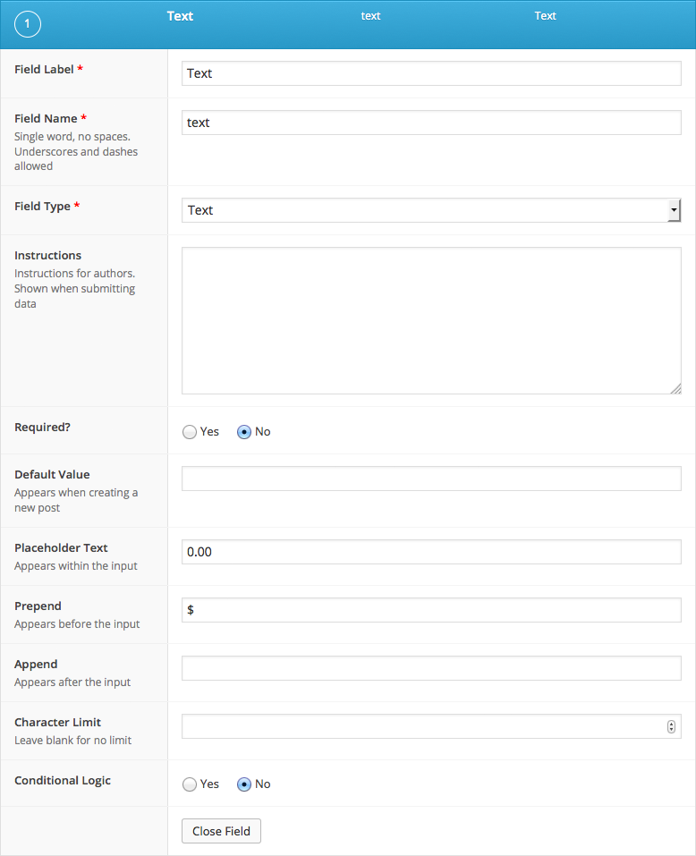

## Description
The Text field creates a basic text input. This field is useful to store single string values.

## Screenshots
<div class="gallery">
	<figure>
		<a href="../assets/acf-text-field-interface.png">
			
		</a>
		<figcaption>The Text field interface</figcaption>
	</figure>
	<figure>
		<a href="../assets/acf-text-field-settings.png">
			
		</a>
		<figcaption>The Text field settings</figcaption>
	</figure>
</div>

## Changelog
- Formatting setting removed in version 5.0.0.

## Settings
- **Default Value**
  Set a default value for this field when creating a new post.

- **Placeholder**
  Appears within input when no value exists.

- **Prepend**
  Adds a visual text element before the input.

- **Append**
  Adds a visual text element after the input.

- **Character Limit**
  Limits the number of characters allowed.

## Template usage

### Display value.
This example demonstrates how to display content within a `h2` tag.
```
<h2><?php the_field( 'text' ); ?></h2>
```
